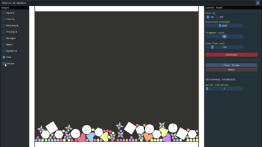

<div align="center">

# ⚛️ Physics2DEngine
## A Handcrafted 2D physics Engine built in java from scratch.
</div>

A custom-built 2D physics engine written entirely in **Java** from the ground up. The engine supports both **convex and concave polygonal shapes**, implements **Separating Axis Theorem (SAT)** for collision detection, and handles realistic physics including **impulse resolution, friction, and rotational dynamics** for both primitive and compound rigid bodies.

This repository includes **Physics2DSandBox**, an interactive demonstration application built with LWJGL, OpenGL, and ImGui. The sandbox provides a real-time environment where you can spawn shapes, trigger dynamic explosions, adjust physics parameters on the fly, and draw custom bodies with freehand input.

---

## 🎬 Demonstration

<p align="center">
  
  
  
  
  
</p>

---

## ⚡ Features

| 🔧 Engine | 🎮 Sandbox Application |
| :--- | :--- |
| **✨ Polygon Support** – Handles both convex and concave polygonal shapes | **💣 Dynamic Explosions** – Trigger explosions with radial force propagation affecting nearby objects |
| **🎯 Collision Detection** – Separating Axis Theorem (SAT) implementation for accurate collision detection | **🌍 Gravity Control** – Toggle gravitational forces on and off in real-time |
| **💥 Physics Resolution** – Impulse-based collision response with friction and angular momentum | **🖥️ Interactive UI** – Adjust physics parameters through an intuitive interface |
| **🧩 Compound Bodies** – Create complex rigid bodies from multiple primitives or freehand strokes | **🎨 Shape Spawning** – Place predefined shapes or draw custom polygonal bodies with mouse input |
| **☕ Pure Java** – Built entirely from scratch without external physics libraries | **⚡ Real-time Rendering** – OpenGL-accelerated rendering with smooth visual feedback |

---

## 📦 Download
Windows build available on the **Releases page**.


1.  Download the **.zip** file
2.  Extract it
3.  Run **Physics2DSandBox.exe**

💡 **Note:** Includes a bundled Java runtime — **no JDK installation required**.

---

## 🛠️ Building from Source

### Prerequisites

* **JDK 25.0.1** or higher
* Gradle wrapper included in repository

### Run the sandbox

```bash
./gradlew run